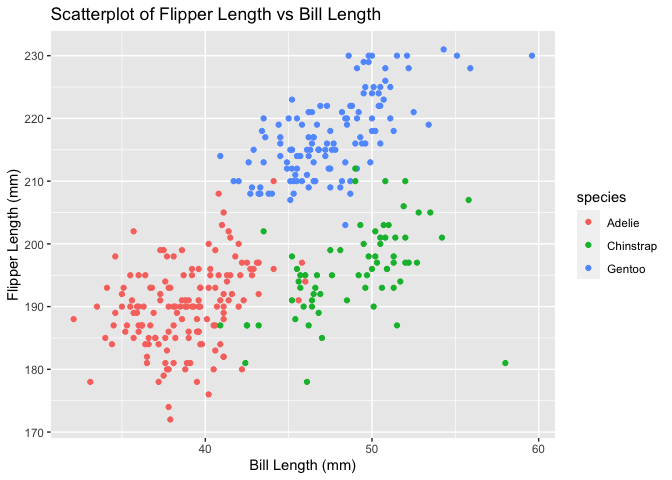

Homework 1
================
Yue Liu

This is my solution to
    HW1

``` r
library(tidyverse)
```

    ## ── Attaching packages ────────────────────────────────── tidyverse 1.3.0 ──

    ## ✓ ggplot2 3.3.2     ✓ purrr   0.3.4
    ## ✓ tibble  3.0.3     ✓ dplyr   1.0.2
    ## ✓ tidyr   1.1.2     ✓ stringr 1.4.0
    ## ✓ readr   1.3.1     ✓ forcats 0.5.0

    ## ── Conflicts ───────────────────────────────────── tidyverse_conflicts() ──
    ## x dplyr::filter() masks stats::filter()
    ## x dplyr::lag()    masks stats::lag()

## Problem 1

Create a data frame with the specified elements.

``` r
prob1_df =
  tibble(
    samp = rnorm(10),
    samp_gt_0 = samp > 0,
    char_vec = c("a","b","c","d","e","f","g","h","i","j"),
    factor_vec = factor(c("low","low","low","mod","mod","mod","mod","high","high","high"))
  )
```

Take the mean of each variable in my data
    frame.

``` r
mean(pull(prob1_df, samp))
```

    ## [1] -0.1981814

``` r
mean(pull(prob1_df, samp_gt_0))
```

    ## [1] 0.3

``` r
mean(pull(prob1_df, char_vec))
```

    ## Warning in mean.default(pull(prob1_df, char_vec)): argument is not numeric or
    ## logical: returning NA

    ## [1] NA

``` r
mean(pull(prob1_df, factor_vec))
```

    ## Warning in mean.default(pull(prob1_df, factor_vec)): argument is not numeric or
    ## logical: returning NA

    ## [1] NA

I can take the mean of numbers and logical but not character or
    factor.

``` r
as.numeric(pull(prob1_df, samp))
```

    ##  [1] -0.7946519  1.0598494 -0.3140168 -0.7422611 -0.8381445 -0.6832529
    ##  [7] -1.5347370  0.9148950 -0.9158857  1.8663917

``` r
as.numeric(pull(prob1_df, samp_gt_0))
```

    ##  [1] 0 1 0 0 0 0 0 1 0 1

``` r
as.numeric(pull(prob1_df, char_vec))
```

    ## Warning: NAs introduced by coercion

    ##  [1] NA NA NA NA NA NA NA NA NA NA

``` r
as.numeric(pull(prob1_df, factor_vec))
```

    ##  [1] 2 2 2 3 3 3 3 1 1 1

``` r
as.numeric(pull(prob1_df, samp_gt_0)) * pull(prob1_df, samp)
```

    ##  [1] 0.000000 1.059849 0.000000 0.000000 0.000000 0.000000 0.000000 0.914895
    ##  [9] 0.000000 1.866392

``` r
factor(pull(prob1_df, samp_gt_0)) * pull(prob1_df, samp)
```

    ## Warning in Ops.factor(factor(pull(prob1_df, samp_gt_0)), pull(prob1_df, : '*'
    ## not meaningful for factors

    ##  [1] NA NA NA NA NA NA NA NA NA NA

``` r
as.numeric(factor(pull(prob1_df, samp_gt_0))) * pull(prob1_df, samp)
```

    ##  [1] -0.7946519  2.1196987 -0.3140168 -0.7422611 -0.8381445 -0.6832529
    ##  [7] -1.5347370  1.8297900 -0.9158857  3.7327833

## Problem 2

Load the penguins dataset.

``` r
data("penguins", package = "palmerpenguins")
```

There are 8 variables contained in this dataset: species, island, bill
length(mm), bill depth(mm), flipper mass(mm), body mass(g), sex, and
year.

Species contains three different groups: Adelie, Chinstrap, and Gentoo.
Island also contains three different groups: Biscoe, Dream, and
Torgersen. Bill length ranges from 32.1mm to 59.6mm. Bill depth ranges
from 13.1mm to 21.5mm. Flipper length ranges from 172mm to 231 mm. Body
mass ranges from 2700g to 6300g. Sex contains 2 groups: female and male.
Year ranges from 2007 to 2009.

The penguins dataset contains 344 rows and 8 columns.

The mean flipper length is 200.9152047 mm.

Generates a scatterplot of flipper length vs bill
length.

``` r
ggplot(penguins, aes(x = bill_length_mm, y = flipper_length_mm, color = species)) + geom_point() + labs(title = "Scatterplot of Flipper Length vs Bill Length",
       x = "Bill Length (mm)", y = "Flipper Length (mm)")
```

    ## Warning: Removed 2 rows containing missing values (geom_point).

<!-- -->

``` r
ggsave("scatterplot.pdf")
```

    ## Saving 7 x 5 in image

    ## Warning: Removed 2 rows containing missing values (geom_point).
